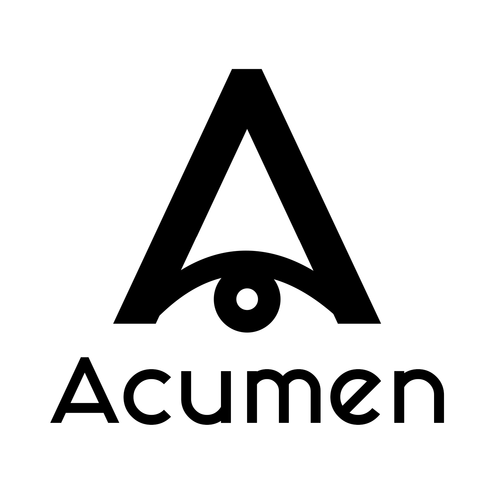

</a>

A clean UI with a modular structure to enhance security researchers' ability to work with data.

## Key Features
- Clean design
- Rating
- Basic data management
- Search
- Filters
- Clipboard templates

## Installation

With Go and NPM installed

- `git clone https://github.com/mhmdiaa/acumen`
- `cd acumen/client`
- `npm install; npm build`
- `cd ..`
- `go get; go build`

## Example usage

`./acumen run -t endpoints -i ~/path/to/data.json -c ./modules/endpoints/ctc_templates.json`

## Creating a new module

See [./modules/endpoints/definition.json](modules/endpoints/definition.json) for an example definition file

```
./acumen create -f /path/to/definition.js
```

**Note:** This project is in testing/alpha stage, but the basic features should work.
